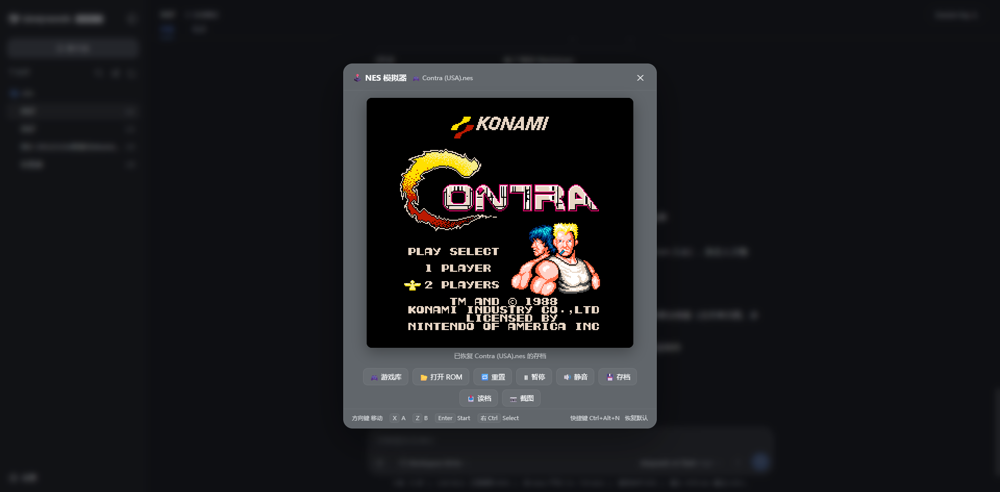

# dsh-plugin-nintendo

一个 DeepSeek Harness (DSH) Web 插件：基于 [jsnes](https://github.com/bfirsh/jsnes) 的 NES 模拟器，通过一个**独立的弹窗页面**运行游戏，支持**快捷键打开/隐藏**，也支持 Agent 通过 `nes_play` 工具直接加载 ROM。



## 功能

- 🕹️ **独立弹窗页面**：DSH Web 页内全屏遮罩弹窗（类似命令面板），`role=dialog`，含游戏画面、工具栏与操作提示
- ⌨️ **快捷键开关**：默认 `Ctrl+Alt+N` 打开/隐藏弹窗；弹窗底部可录制自定义快捷键或恢复默认（存浏览器 localStorage）。隐藏即**暂停并隐藏**，模拟器实例保留，再打开从中断处继续，进度不丢
- 🎮 **jsnes 全功能模拟**：画面、音频、键盘、手柄、帧率全部由 `jsnes.Browser` 处理
- 📂 **四种 ROM 加载方式**：
  1. 弹窗内「🎮 游戏库」：列出插件 `roms/` 目录（或配置的 `romsDir`）下的游戏，点击即玩
  2. 弹窗内「打开 ROM」文件选择器
  3. 直接拖拽 `.nes` / `.unf` 文件到弹窗
  4. Agent 调用 `nes_play <path>` 工具，从磁盘或 roms 目录加载并自动弹出窗口
- 🎛️ 工具栏：游戏库 / 重置 / 暂停·继续 / 静音 / 存档 / 读档 / 截图
- 💾 存档按 ROM 内容哈希隔离存于 localStorage，重开同款 ROM 自动恢复

## 键盘操作（P1 / P2 固定键位）

| 玩家 | 移动 | A | B | Start | Select |
| --- | --- | --- | --- | --- | --- |
| **P1** | `W A S D` | `J` | `K` | `Enter` | 右 `Shift` |
| **P2** | `↑ ↓ ← →` | `1` | `2` | `3` | `4` |

两套键位互不冲突，同一键盘即可双打。另支持 2 个手柄（Gamepad 自动映射 P1 / P2）。

| 按键 | 功能 |
| --- | --- |
| `Ctrl+Alt+N` | 打开 / 隐藏弹窗（暂停并保留进度） |

> 说明：旧版 P1 的 Turbo（`S`/`A`）因与 P1 自身的 `WASD` 移动冲突，已从固定键位中移除。

## 安装

```sh
dsh plugin --profile web add github:beancookie/dsh-plugin-nintendo
```

安装完成后重启 DSH Web 并刷新页面，按 `Ctrl+Alt+N` 即可打开模拟器。

> 插件自带预编译产物（`lib/` 随仓库提交），git 安装无需构建脚本，装完即用。

### 卸载

```sh
dsh plugin --profile web remove dsh-plugin-nintendo
```

## 使用

### 手动游玩

1. 按 `Ctrl+Alt+N`（或在弹窗底部自定义）打开弹窗
2. 点击「🎮 游戏库」从插件 `roms/` 目录选择游戏并点击加载；或点击「打开 ROM」选择本地文件，或直接把文件拖进弹窗
3. 用键盘 / 手柄游玩，工具栏可重置、暂停、静音、存档、读档、截图

> 把 `.nes` / `.unf` 文件放进插件根目录的 `roms/` 文件夹，重启后即可在「游戏库」中看到。

### Agent 加载

对 Agent 发送类似指令：

```
帮我打开 roms 里的 Contra (USA).nes 玩一下
```

Agent 会调用 `nes_play` 工具加载 ROM（支持传 `roms/` 目录内的文件名或绝对路径），弹窗自动出现并开始运行。

## 配置

DSH 设置中可配置：

| 参数 | 类型 | 默认值 | 说明 |
| --- | --- | --- | --- |
| `romsDir` | string | 插件自带 `roms/` | NES ROM 目录；`/nes/roms` 会列出其中的游戏，弹窗「游戏库」从中加载 |
| `maxRomBytes` | number | 4194304 | 允许加载的 ROM 最大字节数 |
| `autoOpen` | boolean | true | Agent 调用 `nes_play` 后是否自动弹出模拟器窗口 |

## 架构

双面插件（host + client），host 与 client 通过同源 HTTP 路由通信：

```
┌─────────────── Web 浏览器 ───────────────┐
│ lib/client.js（客户端 bundle）            │
│ · __ModuleLoader__ 协议 + jsnes 内联      │
│ · 全屏遮罩弹窗 + 快捷键监听 + /nes/* 轮询 │
│          │ fetch（同源 /nes/*）           │
└──────────┼────────────────────────────────┘
┌─────────────── DSH Host ─────────────────┐
│ lib/index.js（cordis 插件）               │
│ · nes_play 工具（ctx.tools.register）     │
│ · /nes/status 当前 ROM 状态               │
│ · /nes/rom?file= 从 roms 目录取指定 ROM   │
│ · /nes/roms  列出 romsDir 下的游戏        │
│ · 默认 romsDir = 插件自带 roms/ 目录      │
└──────────────────────────────────────────┘
```

- **Host 半部**（`src/index.ts`）：注册 `nes_play` 工具与 `/nes/*` 路由，`Config` 经 `@deepseek-ai/schemastery` 校验
- **Client 半部**（`src/client/index.ts`）：`tsdown` 打包为 `window.__ModuleLoader__.load({ id, factory })` 格式，jsnes 经 `deps.alwaysBundle` 内联进 bundle（client 模块表不含 jsnes，不能 `require`）；弹窗为纯 DOM 实现（无需 React），按下快捷键即 open()/hide()（隐藏时暂停模拟并保留实例）

## 开发

```sh
pnpm install
pnpm build      # host: tsc -> lib/index.js；client: tsdown -> lib/client.js
pnpm typecheck
```

> `lib/` 已纳入版本控制：`pnpm install` 不再自动构建，改动 `src/` 后需手动 `pnpm build` 并将 `lib/` 一并提交，以保证 git 安装用户拿到的是最新编译产物。

本地加载（`--patch` 开发模式）：

```sh
pnpm dsh web --patch "C:\Users\luzho\Documents\github\dsh-plugin-nintendo\dev.cordis.patch.yml"
```

## 社区

本项目积极支持并感谢 [LINUX DO](https://linux.do) 社区——一个面向技术爱好者的友好交流空间。

## 许可

MIT
